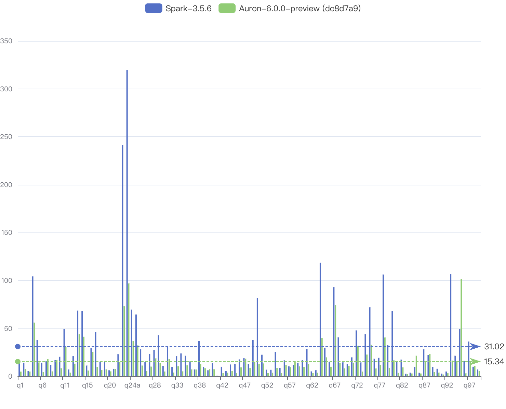

<!--
- Licensed to the Apache Software Foundation (ASF) under one or more
- contributor license agreements.  See the NOTICE file distributed with
- this work for additional information regarding copyright ownership.
- The ASF licenses this file to You under the Apache License, Version 2.0
- (the "License"); you may not use this file except in compliance with
- the License.  You may obtain a copy of the License at
-
-   http://www.apache.org/licenses/LICENSE-2.0
-
- Unless required by applicable law or agreed to in writing, software
- distributed under the License is distributed on an "AS IS" BASIS,
- WITHOUT WARRANTIES OR CONDITIONS OF ANY KIND, either express or implied.
- See the License for the specific language governing permissions and
- limitations under the License.
-->

# Apache Auron (Incubating)

[](https://github.com/apache/auron/actions/workflows/tpcds.yml)
[](https://github.com/apache/auron/actions/workflows/build-amd64-releases.yml)

<p align="center"></p>

The Auron accelerator for big data engines (e.g., Spark, Flink) leverages native vectorized execution to accelerate query processing. It combines
the power of the [Apache DataFusion](https://arrow.apache.org/datafusion/) library and the scale of the distributed
computing framework.

Auron takes a fully optimized physical plan from distributed computing framework, mapping it into DataFusion's execution plan, and performs native
plan computation.

The key capabilities of Auron include:

- **Native execution**:  Implemented in Rust, eliminating JVM overhead and enabling predictable performance.
- **Vectorized computation**: Built on Apache Arrow's columnar format, fully leveraging SIMD instructions for batch processing.
- **Pluggable architecture:**: Seamlessly integrates with Apache Spark while designed for future extensibility to other engines.
- **Production-hardened optimizations:** Multi-level memory management, compacted shuffle formats, and adaptive execution strategies developed through large-scale deployment.

Based on the inherent well-defined extensibility of DataFusion, Auron can be easily extended to support:

- Various object stores.
- Operators.
- Simple and Aggregate functions.
- File formats.

We encourage you to extend [DataFusion](https://github.com/apache/arrow-datafusion) capability directly and add the
supports in Auron with simple modifications in plan-serde and extension translation.

## Build from source

To build Auron from source, follow the steps below:

1. Install Rust

Auron's native execution lib is written in Rust. You need to install Rust (nightly) before compiling.

We recommend using [rustup](https://rustup.rs/) for installation.

2. Install JDK

Auron has been well tested with JDK 8, 11, and 17.

Make sure `JAVA_HOME` is properly set and points to your desired version.

3. Check out the source code.

4. Build the project.

You can build Auron either *locally* or *inside Docker* using one of the supported OS images via the unified script: `auron-build.sh`.

Run `./auron-build.sh --help` to see all available options.

After the build completes, a fat JAR with all dependencies will be generated in either the `target/` directory (for local builds)
or `target-docker/` directory (for Docker builds), depending on the selected build mode.

## Run Spark Job with Auron Accelerator

This section describes how to submit and configure a Spark Job with Auron support.

1. Move the Auron JAR to the Spark client classpath (normally spark-xx.xx.xx/jars/).

2. Add the following configs to spark configuration in `spark-xx.xx.xx/conf/spark-default.conf`:

```properties
spark.auron.enable true
spark.sql.extensions org.apache.spark.sql.auron.AuronSparkSessionExtension
spark.shuffle.manager org.apache.spark.sql.execution.auron.shuffle.AuronShuffleManager
spark.memory.offHeap.enabled false

# suggested executor memory configuration
spark.executor.memory 4g
spark.executor.memoryOverhead 4096
```

3. submit a query with spark-sql, or other tools like spark-thriftserver:
```shell
spark-sql -f tpcds/q01.sql
```

## Run Flink Tests with Auron

Auron also supports Apache Flink integration. This section describes how to run tests and examples with Auron-accelerated Flink execution.

**For comprehensive build instructions** (including building Flink with Auron integration), see [BUILD-GUIDE.md](BUILD-GUIDE.md).

### Prerequisites

**Java 17** is required for building and running Flink tests:

```bash
export JAVA_HOME=/Library/Java/JavaVirtualMachines/jdk17.0.5-msft.jdk/Contents/Home
```

While Auron compiles to Java 8 bytecode for compatibility, Maven plugins (especially spotless) and Apache Arrow require Java 11+. Java 17 is recommended for all development work.

### Building - Complete Stack

To build both Flink (with Auron integration) and Auron:

```bash
# Build everything with one command (recommended for first time)
./build-all.sh

# Fast build (skip tests)
./build-all.sh --skip-tests

# Build only Auron (assumes Flink already built)
./build-all.sh --auron-only
```

See [BUILD-GUIDE.md](BUILD-GUIDE.md) for complete details.

### Building - Auron Only

If Flink 1.18-SNAPSHOT is already built, use the Auron-only build script:

```bash
./build-flink.sh          # Build and install (skip tests)
./build-flink.sh clean    # Clean build from scratch
./build-flink.sh test     # Build and run tests
```

Or manually with Maven:

```bash
export JAVA_HOME=/Library/Java/JavaVirtualMachines/jdk17.0.5-msft.jdk/Contents/Home
./build/apache-maven-3.9.12/bin/mvn clean install -DskipTests \
  -Pflink-1.18 -Pscala-2.12
```

### Running Tests

#### Quick Test Execution (Recommended)

Use the simplified example runner:

```bash
cd auron-flink-extension/auron-flink-planner

./run-example.sh groupby   # GROUP BY with hybrid execution (default)
./run-example.sh parallel  # 50K rows with parallelism=4
./run-example.sh mvp       # MVP example with parallelism=1
```

**What these tests demonstrate:**
- `groupby`: Auron native ParquetScan + Flink GROUP BY aggregations (hybrid execution)
- `parallel`: Distributed file splitting across 4 parallel tasks
- `mvp`: Basic Auron integration with multiple query types

**Performance**: First run copies dependencies (~30 seconds), subsequent runs start immediately.

#### Integration Tests

For comprehensive integration tests:

```bash
cd auron-flink-extension/auron-flink-planner
export JAVA_HOME=/Library/Java/JavaVirtualMachines/jdk17.0.5-msft.jdk/Contents/Home

# Run execution verification test (shows Auron conversion logs)
./run-e2e-test-final.sh

# Or explicitly specify test type
./run-e2e-test-final.sh Execution  # AuronExecutionVerificationTest (default)
./run-e2e-test-final.sh Simple     # AuronSimpleVerificationTest
./run-e2e-test-final.sh Manual     # AuronEndToEndManualTest
```

#### Option 2: Maven Test

Run tests using Maven from the Auron root directory:

```bash
export JAVA_HOME=/Library/Java/JavaVirtualMachines/jdk17.0.5-msft.jdk/Contents/Home
./build/apache-maven-3.9.12/bin/mvn test \
  -pl auron-flink-extension/auron-flink-planner -am \
  -Dtest=AuronExecutionVerificationTest \
  -Pflink-1.18 -Pscala-2.12
```

Replace `AuronExecutionVerificationTest` with other test class names as needed.

#### Option 3: Direct Java Execution

For advanced users who want full control:

```bash
export JAVA_HOME=/Library/Java/JavaVirtualMachines/jdk17.0.5-msft.jdk/Contents/Home

CLASSPATH="auron-flink-extension/auron-flink-planner/target/test-classes:auron-flink-extension/auron-flink-planner/target/classes:auron-flink-extension/auron-flink-planner/target/lib/*" \
  $JAVA_HOME/bin/java --add-opens=java.base/java.nio=ALL-UNNAMED \
  org.apache.auron.flink.examples.AuronFlinkGroupByTest
```

Available test classes:
- `AuronFlinkGroupByTest` - GROUP BY hybrid execution
- `AuronFlinkParallelTest` - 50K rows, parallelism=4
- `AuronFlinkMVPWorkingExample` - MVP with multiple queries

### Expected Output

When tests run successfully with Auron, you should see log messages indicating native execution:

```
------ initializing auron native environment ------
[INFO] [auron::exec:70] - initializing JNI bridge
[INFO] [auron_jni_bridge::jni_bridge:491] - ==> FLINK MODE: Spark/Scala classes will be skipped
[INFO] [auron::rt:147] - start executing plan:
ParquetExec: limit=None, file_group=[...]
[INFO] [datafusion_datasource_parquet::opener:421] - executing parquet scan with adaptive batch size: 8192
[INFO] [auron::rt:188] - task finished
✅ All queries executed successfully with Auron!
```

### Troubleshooting

**Architecture Mismatch Error**: If you see `mach-o file, but is an incompatible architecture`, ensure you're using the correct Java architecture (ARM64 for Apple Silicon, x86_64 for Intel).

**Arrow Memory Error**: If you see `Failed to initialize MemoryUtil`, ensure you're using the `--add-opens=java.base/java.nio=ALL-UNNAMED` JVM flag when running with Java 17+.

**Dependency Resolution Error**: If Maven can't resolve `auron-flink-extension`, always run Maven commands from the Auron root directory and use the `-am` flag to build dependencies from the reactor.

For more details, see [CLAUDE.md](CLAUDE.md).

## Performance

TPC-DS 1TB Benchmark Results:



For methodology and additional results, please refer to [benchmark documentation](https://auron.apache.org/documents/benchmarks.html).

We also encourage you to benchmark Auron and share the results with us. 🤗

## Community

### Subscribe Mailing Lists

Mail List is the most recognized form of communication in the Apache community.
Contact us through the following mailing list.

| Name                                                       | Scope                           |                                                          |                                                               | 
|:-----------------------------------------------------------|:--------------------------------|:---------------------------------------------------------|:--------------------------------------------------------------|
| [dev@auron.apache.org](mailto:dev@auron.apache.org)  | Development-related discussions | [Subscribe](mailto:dev-subscribe@auron.apache.org)    | [Unsubscribe](mailto:dev-unsubscribe@auron.apache.org)     |


### Contributing

Interested in contributing to Auron? Please read our [Contributing Guide](CONTRIBUTING.md) for detailed information on how to get started.

## License

Auron is licensed under the Apache 2.0 License. A copy of the license
[can be found here.](LICENSE)
