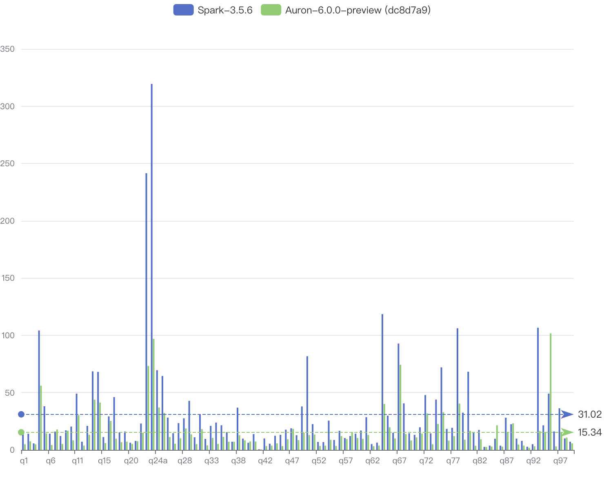

<!--
- Licensed to the Apache Software Foundation (ASF) under one or more
- contributor license agreements.  See the NOTICE file distributed with
- this work for additional information regarding copyright ownership.
- The ASF licenses this file to You under the Apache License, Version 2.0
- (the "License"); you may not use this file except in compliance with
- the License.  You may obtain a copy of the License at
-
-   http://www.apache.org/licenses/LICENSE-2.0
-
- Unless required by applicable law or agreed to in writing, software
- distributed under the License is distributed on an "AS IS" BASIS,
- WITHOUT WARRANTIES OR CONDITIONS OF ANY KIND, either express or implied.
- See the License for the specific language governing permissions and
- limitations under the License.
-->

# Apache Auron

[](https://github.com/apache/auron/actions/workflows/tpcds.yml)
[](https://github.com/apache/auron/actions/workflows/build-amd64-releases.yml)

<p align="center"></p>

Apache Auron is an accelerator for big data engines, leveraging native vectorized execution to accelerate query processing. It combines
the power of the [Apache DataFusion](https://arrow.apache.org/datafusion/) library and the scale of the distributed
computing framework.

Auron takes a fully optimized physical plan from a distributed computing framework, mapping it into DataFusion's execution plan, and performs native
plan computation.

The key capabilities of Auron include:

- **Native execution**: Implemented in Rust, eliminating JVM overhead and enabling predictable performance.
- **Vectorized computation**: Built on Apache Arrow's columnar format, fully leveraging SIMD instructions for batch processing.
- **Pluggable architecture**: Seamlessly integrates with Apache Spark while designed for future extensibility to other engines.
- **Production-hardened optimizations**: Multi-level memory management, compacted shuffle formats, and adaptive execution strategies developed through large-scale deployment.

Based on the inherent well-defined extensibility of DataFusion, Auron can be easily extended to support:

- Various object stores.
- Operators.
- Simple and Aggregate functions.
- File formats.

We encourage you to extend [DataFusion](https://github.com/apache/arrow-datafusion) capability directly and add support in
Auron with simple modifications in plan-serde and extension translation.

## Build from source

To build Auron from source, follow the steps below:

1. Install Rust

Auron's native execution lib is written in Rust. You need to install Rust (nightly) before compiling.

We recommend using [rustup](https://rustup.rs/) for installation.

2. Install JDK

Auron is regularly tested on JDK 8, 11, and 17, and is also tested on JDK 21.

Make sure `JAVA_HOME` is properly set and points to your desired version.

3. Check out the source code.

4. Build the project.

You can build Auron either *locally* or *inside Docker* using one of the supported OS images via the unified script: `auron-build.sh`.

Run `./auron-build.sh --help` to see all available options.

After the build completes, a fat JAR with all dependencies will be generated in either the `target/` directory (for local builds)
or `target-docker/` directory (for Docker builds), depending on the selected build mode.

## Run Spark Job with Auron Accelerator

This section describes how to submit and configure a Spark Job with Auron support.

1. Move the Auron JAR to the Spark client classpath (normally spark-xx.xx.xx/jars/).

2. Add the following configs to spark configuration in `spark-xx.xx.xx/conf/spark-default.conf`:

```properties
spark.auron.enable true
spark.sql.extensions org.apache.spark.sql.auron.AuronSparkSessionExtension
spark.shuffle.manager org.apache.spark.sql.execution.auron.shuffle.AuronShuffleManager
spark.memory.offHeap.enabled false

# suggested executor memory configuration
spark.executor.memory 4g
spark.executor.memoryOverhead 4096
```

3. submit a query with spark-sql, or other tools like spark-thriftserver:
```shell
spark-sql -f tpcds/q01.sql
```

For ORC files with large String/Binary values, set `spark.auron.orc.batchSize` to a
smaller positive row count (for example, `--conf spark.auron.orc.batchSize=1024`)
when starting the application. It defaults to `spark.auron.batchSize` and only
controls native ORC decoding; downstream operators may coalesce these batches.
Smaller batches reduce the risk of offset overflow but cannot accommodate an
individual value that exceeds Arrow's offset limit.

## Native conversion diagnostics in the Spark UI

After configuring Auron as described above, enable the Spark UI and Auron tab
in `conf/spark-defaults.conf` before starting the application. This file accepts
whitespace-separated keys and values:

```properties
spark.ui.enabled true
spark.auron.ui.enabled true
```

Alternatively, add `--conf spark.ui.enabled=true` and
`--conf spark.auron.ui.enabled=true` to your `spark-submit` or `spark-shell`
command. The `--conf` option requires the `key=value` format.

The Auron UI option defaults to `true`. Open the application's Spark UI and select
the **Auron** tab. For direct access, the URL is
`http[s]://<spark-ui-host>:<spark-ui-port>/auron/`. Use the application's actual
Spark UI address from its startup output or cluster manager. If the UI is accessed
through a proxy, open the provided Spark UI link and select the **Auron** tab.
Keep the application running while inspecting its live UI.

Alongside build information, the tab provides a paginated SQL execution list.
Select a SQL ID to inspect conversion snapshots, per-operator fallback reasons,
physical plans, selected configuration values captured at conversion time, and
available Spark SQL operator metrics. A link opens the corresponding Spark SQL
execution page for jobs and stages.

### Basic concepts

| Term | Meaning |
| --- | --- |
| SQL execution / SQL ID | A Spark SQL execution tracked by Spark and identified by its execution ID. It can originate from SQL or DataFrame/Dataset operations and can involve multiple Spark jobs and stages. |
| Physical plan / operator | A physical plan describes how Spark executes an operation. Its nodes are operators, such as scans, filters, joins, and aggregations, or wrappers around other nodes. |
| Native conversion | Auron converts supported Spark operators into operators that use its native execution engine. A plan can contain both native and Spark operators. |
| Fallback | An operator remains in Spark, with a recorded reason explaining why native conversion was not used. This does not by itself mean that the SQL execution failed. |
| Conversion snapshot | A diagnostic record captured after a plan conversion, associated with a SQL execution ID. It contains a capture timestamp, physical plan text, per-node conversion statuses and recorded fallback reasons, and selected configuration values. |
| Adaptive Query Execution (AQE) | Spark's mechanism for adapting an execution plan using runtime information. It can lead to additional plan conversions and snapshots during the same SQL execution. |

A snapshot describes the plan at a particular conversion point. It contains no
query result data and is not a checkpoint for recovering execution. One SQL
execution can have multiple snapshots, and a snapshot can cover an individual
stage rather than the entire query. The **Snapshots** column reports the number
of retained diagnostic snapshots, not the number of jobs, stages, or query runs.

The operator metrics shown on the detail page are retrieved separately from
Spark SQL's status store. They are not a copy of metric values at the time each
conversion snapshot was captured.

### Interpreting conversion results

| Status | Meaning |
| --- | --- |
| Native | The operator was converted to native execution. |
| Fallback | The operator remains in Spark with a recorded reason, such as disabled conversion or an unsupported operator or expression. |
| Other Spark | No fallback reason was recorded for the Spark operator in this snapshot; this does not imply successful native conversion. |
| Wrapper | A planning or execution wrapper, excluded from native and fallback counts. Inspect its child operators for conversion results. |

AQE may convert individual stages separately. The execution list shows counts
from the latest snapshot, not totals across the entire query. Up to 20 recent
snapshots are retained per execution, with consecutive identical snapshots
collapsed. Shared plan objects are counted once per snapshot, and diagnostic node
IDs are local to each snapshot rather than Spark SQL plan-graph IDs.

Conversion snapshots require Auron to be enabled and a SQL execution ID to be
available during conversion. Executions without snapshots show **Not available**
instead of zero conversion counts. **Finished** indicates that execution ended;
it does not distinguish success from failure.

Metrics include timing, row counts, memory, spill, and shuffle information when
reported by the operators. Values retain Spark's units and aggregation semantics
and are not summed across operators. Metrics depend on Spark SQL's own retention
and may be unavailable even when a diagnostic snapshot is retained.

### Retention and historical applications

Diagnostic records use `spark.sql.ui.retainedExecutions` for cleanup, preserving
active executions. Stored physical plan text is limited to 65,536 characters and
individual fallback reasons to 8,192 characters. These limits bound stored text,
not the cost of generating the plan string. Plan text and fallback reasons follow
Spark's configured string redaction pattern; configuration capture uses an
allowlist of diagnostic settings.

For historical applications, enable `spark.eventLog.enabled=true` before running
the application and configure Spark's event-log storage. Make the matching Auron
JAR available on the Spark History Server classpath so its bundled history plugin
can replay diagnostic events. Event logs created without those events cannot
reconstruct conversion snapshots.

## Performance

TPC-DS 1TB Benchmark Results:



For methodology and additional results, please refer to [benchmark documentation](https://auron.apache.org/documents/benchmarks.html).

We also encourage you to benchmark Auron and share the results with us. 🤗

## Community

### Subscribe Mailing Lists

Mail List is the most recognized form of communication in the Apache community.
Contact us through the following mailing list.

| Name                                                       | Scope                           |                                                          |                                                               | 
|:-----------------------------------------------------------|:--------------------------------|:---------------------------------------------------------|:--------------------------------------------------------------|
| [dev@auron.apache.org](mailto:dev@auron.apache.org)  | Development-related discussions | [Subscribe](mailto:dev-subscribe@auron.apache.org)    | [Unsubscribe](mailto:dev-unsubscribe@auron.apache.org)     |


### Contributing

Interested in contributing to Auron? Please read our [Contributing Guide](CONTRIBUTING.md) for detailed information on how to get started.

## License

Auron is licensed under the Apache 2.0 License. A copy of the license
[can be found here.](LICENSE)
